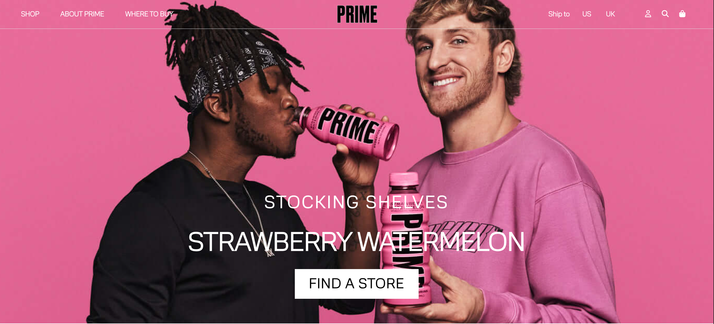

# DrinkPrime Clone (Responsive)

A responsive landing page replica of the DrinkPrime website. This project is built using pure HTML and CSS to ensure the layout adapts to different screen sizes, from mobile to desktop.


<br>
<br>


🔗 **[Live Website](https://afsal4.github.io/Drinkprime/)**

## 📂 Project Overview

* **Responsive Layout:** The design adjusts automatically for mobile, tablet, and desktop views.
* **Custom Assets:** Includes custom fonts and high-quality SVG/JPG imagery to match the original brand aesthetic.
* **Pure CSS:** Built entirely with custom stylesheets without using any CSS frameworks.

## 📂 File Structure

* `index.html` - Main page structure.
* `styles.css` - Custom styles and responsive media queries.
* `NormalidadText-Thin.ttf` - Custom font file.
* `svg1.svg` & `s1-pic.jpg` - Image assets.

## 🚀 How to Run

1. Clone the repository:
```bash
git clone https://github.com/afsal4/Drinkprime.git  
```
